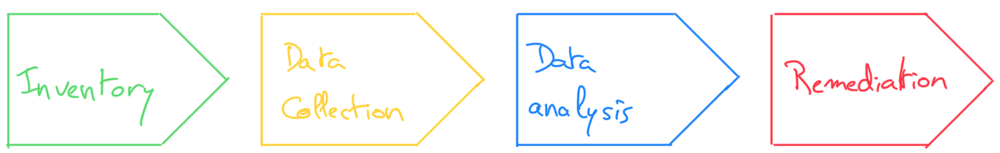
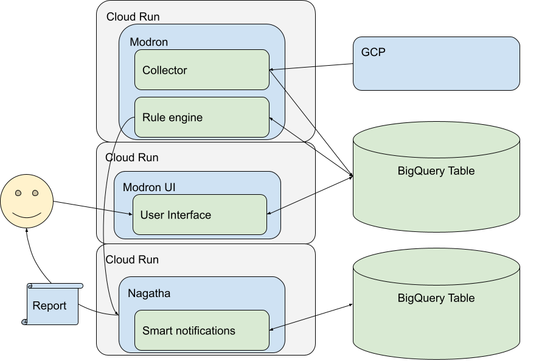

# Modron - Cloud security compliance


```
”
We are the ultimate law. All other law is tainted when compared to us.
We are order. All other order disappears when held to our light.
We are structure. All other structure crumbles when brought against us.
We are perfect law.
”
— A spokesmodron
```

Monte Cook, Colin McComb (1997-10-28). The Great Modron March. Edited by Michele Carter. (TSR, Inc.), p. 26. ISBN 0-7869-0648-0.

The rise of cloud computing has sharply increased the number of resources that need to be managed in a production environment. This has increased the load on security teams. At the same time, vulnerability and compliance scanning on the cloud have made little progress. The process of inventory, data collection, analysis and remediation have scaled up, but did not evolve to manage the scale and diversity of cloud computing assets. Numerous security tools still assume that maintaining inventory, collecting data, looking at results and fixing issues is performed by the same person. This leads to increased pressure on teams already overwhelmed by the size of their infrastructure.

Maintaining a secure cloud infrastructure is surprisingly hard. Cloud computing came with the promise of automation and ease of use, yet there is a lot of progress to be made on both of these fronts. Infrastructure security also suffered from the explosion of assets under management and lack of security controls on new and existing assets. 

Modron addresses the inventory and ownership issues raising with large cloud infrastructure, as well as the scalability of the remediation process by resolving ownership of assets and handling communication with different asset owners.
Modron still has the security practitioners and leadership teams in mind and provides organization wide statistics about the reported issues.

Designed with multi cloud and scalability in mind, Modron is based on GCP today. The model allows for writing detection rules once and apply them across multiple platforms.

## Taxonomy

A *Resource* is an entity existing in the cloud platform. A resource can be a VM instance, a service account, a kubernetes clusters, etc. 

A *Resource group* is the smallest administrative grouping of resources, usually administered by the same individual or group of individuals. On GCP this corresponds to a Project, on Azure to a Resource Group. 

A *Rule* is the implementation of a desired state for a given resource or set of resources. A rule applies only to a predefined set of resources, compares the state of the resource with the expected state. If these states differ, the rule generates one or more *observation*.

An *Observation* is an instance of a difference between the state of a resource and its expected state at a given timestamp.

A *Collection* defines the action of fetching all data from the cloud platforms. This data is then stored in the database, ready to run the scan.

A *Scan* defines the action of running a set of *rules* against a set of *resource groups*. *Observations* resulting of that scan are added to the database. There is no guarantee that all observations of the same scan will have the same timestamp.

*Nagatha* is the notification system associated with Modron. It aggregates notifications going to the same recipient over a given time frame and sends a notification to that user. 

A *Notification* is an instance of a message sent to an owner of a *resource group* for a given *observation*. 

An *Exception* is one owner of a *resource group* opting out of *notifications* for a specific *rule*. Exceptions *must* have an expiration date and cannot be set forever. This limitation can be bypassed by accessing the nagatha service directly.

## Process

Modron follows the process of any security scanning engine:



Except that in most scanning engines, the inventory and remediation parts are left as an exercise for the user.
In Modron, inventory is taken care of by identifying automatically the owners of a resource group based on the people that have the permission to act on it, as the remediation is largely facilitated by running the communication with the different resource group owners.

*   *Collector*: The collector fetches the data from the cloud platforms. This code must be implemented for each supported code platform separately. It takes care of the inventory and data collection parts of the process.
*   *Rule engine*: The rule engine runs the rules against all collected resources and generates observations. Notifications are sent to Nagatha for each observation.
*   *Nagatha* receives all the notifications for all observations, aggregates, deduplicates and limits the rate of notification. It also applies the exceptions provided by the user. 

## Getting started

In order to install Modron & Nagatha, you'll need to:

1. Build the modron images:
    * in [src/](src): `gcloud builds builds submit . --tag gcr.io/your-project/modron:prod --timeout 900`
    * in [src/ui/](src/ui): `gcloud builds builds submit . --tag gcr.io/your-project/modron-ui:prod --timeout 900`
    * in [nagatha/](nagatha): `gcloud builds submit . --tag gcr.io/your-project/nagatha:dev --timeout=900`
1. Create a copy of [main.tf.example](terraform/dev/main.tf.example) and edit it with your own configuration
1. Run `tf plan --out tf.plan` in the [dev folder](terraform/dev/)
    * This could need multiple occurrences as setting up resources on GCP takes time.
1. Create a copy of [tf.tfvars.json.example](nagatha/terraform/tf.tfvars.json.example) and edit it with your own configuration
1. Run `tf plan --out tf.plan` in the [nagatha folder](nagatha/terraform/)
1. Assign the permissions to the Modron runner as mentioned in [permissions](#permissions)

## Logo

Generated with Dall-E with "logo art of a victorian cubical robot in a tuxedo with a top hat and holding binoculars"

## Start developing on Modron

### Infrastructure

Here is an overview of Modron's infrastructure:



Both Modron Cloud Run run in the same [modron project](https://console.cloud.google.com/home/dashboard?project=modron).
Nagatha runs in a [separate project](https://console.cloud.google.com/home/dashboard?project=nagatha).

There is a dev container. This project is meant to be opened with [VSCode](https://code.visualstudio.com/). 

To run this project you'll need:

* Docker
* Go
* The Google SDK
* A protobuf compiler
* npm

The dev container provides these tools. Upon starting, vscode will ask if you want to reopen the project in the dev container, accept.

If you have problems with your git configuration inside the container, set `remote.containers.copyGitConfig` to true.
https://github.com/microsoft/vscode-remote-release/issues/6124

## Permissions

The Modron service is meant to work at the organization level on GCP. In order to access the data it needs to run the analysis, the Modron runner service account will need the following permissions at the organization level:

```
    "apikeys.keys.list",
    "cloudasset.assets.searchAllIamPolicies",
    "compute.backendServices.list",
    "compute.instances.list",
    "compute.regions.list",
    "compute.sslCertificates.list",
    "compute.sslPolicies.list",
    "compute.subnetworks.list",
    "compute.targetHttpsProxies.list",
    "compute.targetHttpsProxies.list",
    "compute.targetSslProxies.list",
    "compute.urlMaps.list",
    "compute.zones.list",
    "container.clusters.list",
    "iam.serviceAccounts.list",
    "iam.serviceAccountKeys.list",
    "monitoring.metricDescriptors.get",
    "monitoring.metricDescriptors.list",
    "monitoring.timeSeries.list",
    "resourcemanager.projects.getIamPolicy",
    "serviceusage.services.get",
    "storage.buckets.list",
    "storage.buckets.getIamPolicy",
```

It is recommended to create a custom role with these permissions. For that you can use this terraform stanza:

```
resource "google_organization_iam_custom_role" "modron_lister" {
  org_id      = var.org_id
  role_id     = "ModronSecurityLister"
  title       = "Modron Security Lister"
  description = "All list permissions for Modron the security compliance scanner"
  permissions = [
    "apikeys.keys.list",
    "cloudasset.assets.searchAllIamPolicies",
    "compute.backendServices.list",
    "compute.instances.list",
    "compute.regions.list",
    "compute.sslCertificates.list",
    "compute.sslPolicies.list",
    "compute.subnetworks.list",
    "compute.targetHttpsProxies.list",
    "compute.targetHttpsProxies.list",
    "compute.targetSslProxies.list",
    "compute.urlMaps.list",
    "compute.zones.list",
    "container.clusters.list",
    "iam.serviceAccounts.list",
    "iam.serviceAccountKeys.list",
    "monitoring.metricDescriptors.get",
    "monitoring.metricDescriptors.list",
    "monitoring.timeSeries.list",
    "resourcemanager.projects.getIamPolicy",
    "serviceusage.services.get",
    "storage.buckets.list",
    "storage.buckets.getIamPolicy",
  ]
}
```

## Debug

Run gosec as run by gitlab:

```
docker run -i --tty --rm --volume "$PWD":/tmp/app --env CI_PROJECT_DIR=/tmp/app registry.gitlab.com/security-products/gosec:3 /analyzer run
```

## Testing

### Unit test

There are quite a few unit test on Modron. If you want to run the go tests:

```
cd src/
go test ./... --short
```

### Integration test

To run the integration test, you'll need a self signed certificate for the notification service.

```
openssl req -x509 -newkey rsa:4096 -keyout key.pem -nodes -out cert.pem -sha256 -days 365 -subj '/CN=modron_test' -addext "subjectAltName = DNS:modron_test"
docker-compose up --build --exit-code-from "modron_test" --abort-on-container-exit
```

### UI Integration test

```
docker-compose -f docker-compose.ui.yaml up --build --exit-code-from "modron_test" --abort-on-container-exit
```

### Running locally

Use this docker command to spin up a local deployment via docker-compose (will rebuild on every run):
```
docker-compose -f docker-compose.ui.yaml up --build
```
In case you want to clean up all the created images, services and volumes (e.g. if you suspect a caching issue or if a service does not properly shut down):
```
docker-compose rm -fsv # remove all images, services and volumes if needed
```


Alternative: Use the docker command to run modron locally (against a dev project):

```
chmod 644 ~/.config/gcloud/application_default_credentials.json
docker build -f Dockerfile.db -t modron-db:latest .
docker run -e POSTGRES_PASSWORD="docker-test-password" -e POSTGRES_USER="modron" -e POSTGRES_DB="modron" -e PG_DATA="tmp_data/" -t modron-db:latest -p 5432
GOOGLE_APPLICATION_CREDENTIALS=~/.config/gcloud/application_default_credentials.json PORT="8080" GCP_PROJECT_ID=modron-dev OPERATION_TABLE_ID="operations" OBSERVATION_TABLE_ID="observations" RESOURCE_TABLE_ID="resources" RUN_AUTOMATED_SCANS="false" ORG_SUFFIX="@example.com" STORAGE="SQL" DB_MAX_CONNECTIONS="1" SQL_BACKEND_DRIVER="postgres" SQL_CONNECT_STRING="host=localhost port=5432 user=modron password=docker-test-password database=modron sslmode=disable" go run . --logtostderr
```

## Future developments

* Provide an historical view of the reported issues.
* Support AWS for analysis
* Support Azure for analysis
* Hands-off installation process

## Security

Report any security issue to [security@example.com](mailto:security@example.com). 
