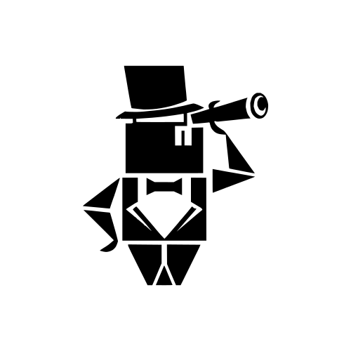
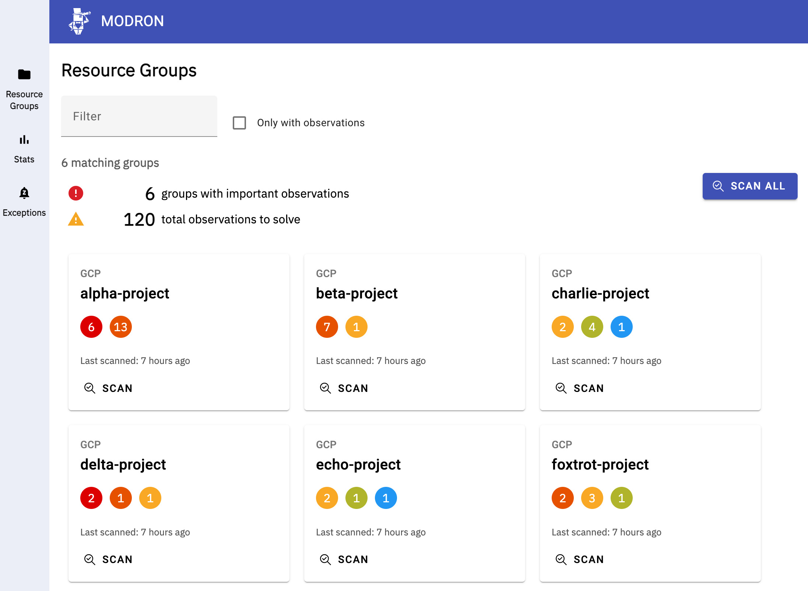
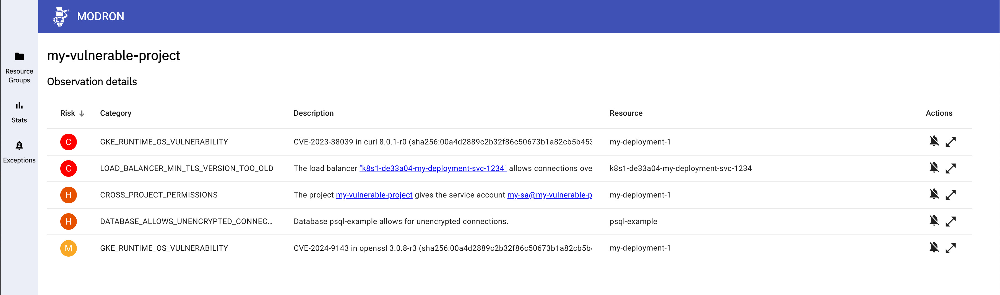
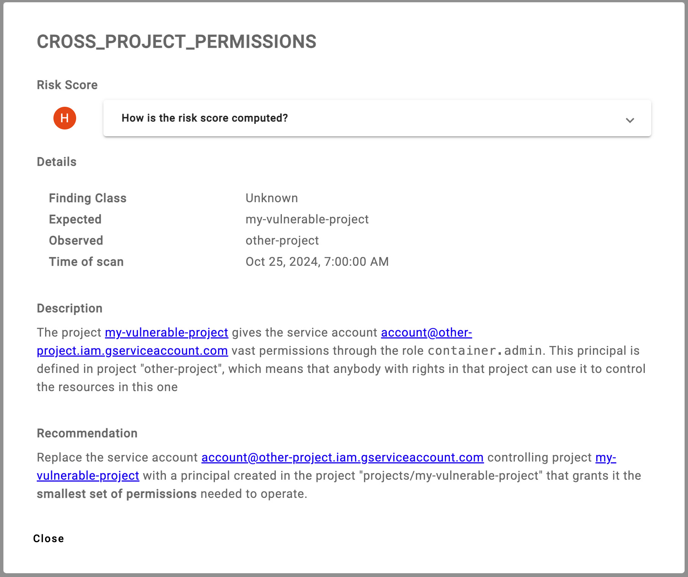
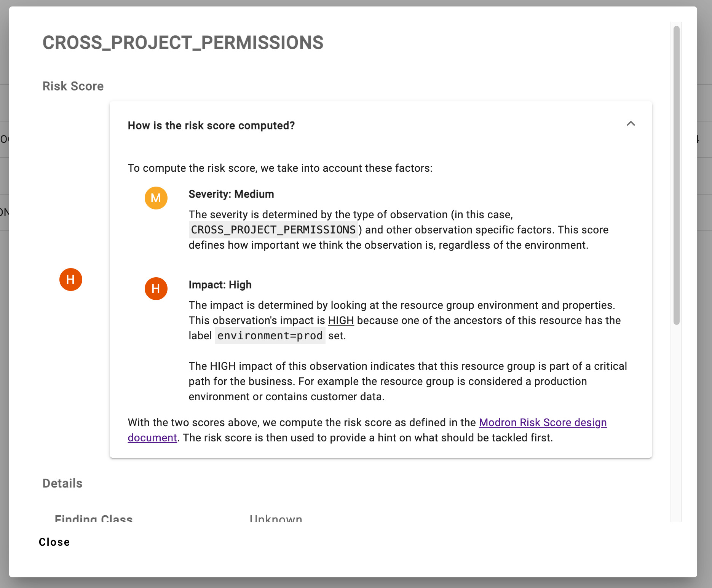
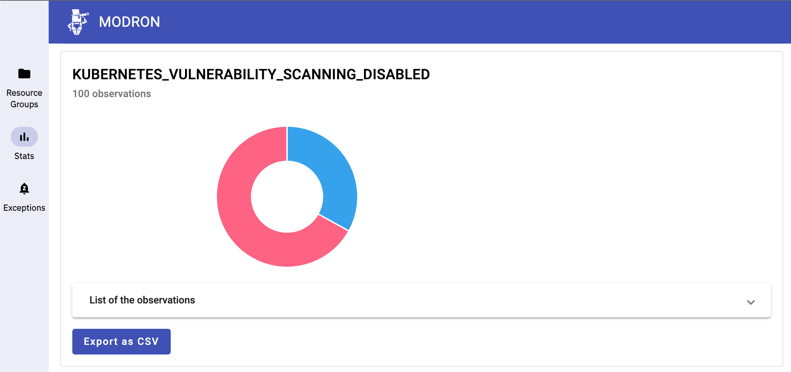
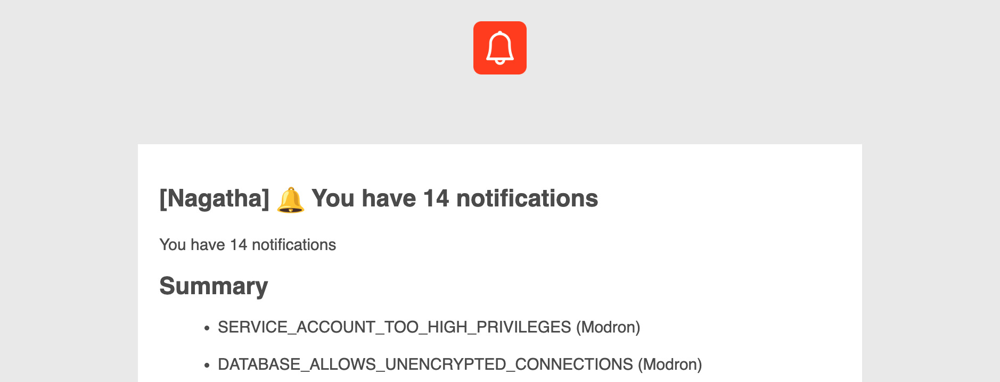
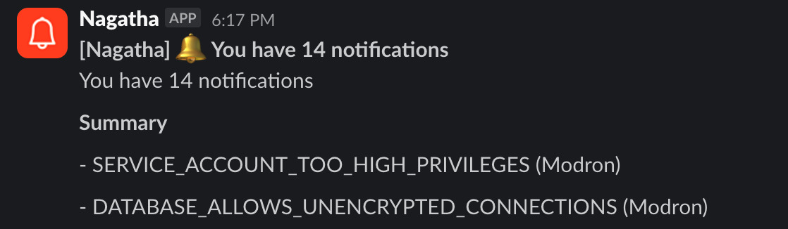
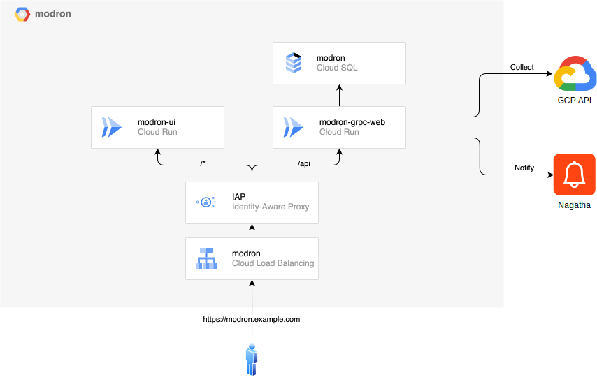
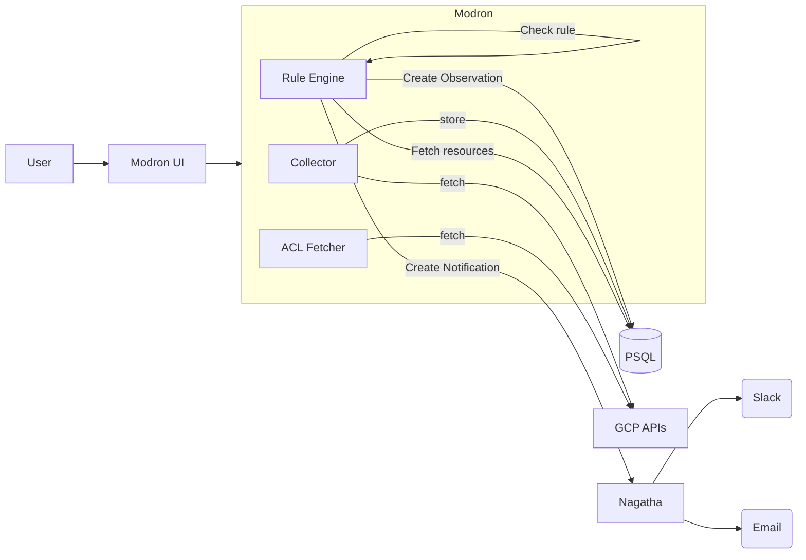

# Modron - Cloud security compliance

<p align="center">

</p>

> _We are the ultimate law. All other law is tainted when compared to us.  
> We are order. All other order disappears when held to our light.  
> We are structure. All other structure crumbles when brought against us.  
> We are perfect law._  
>   
> — A spokesmodron
 
<small>Monte Cook, Colin McComb (1997-10-28). The Great Modron March. Edited by Michele Carter. (TSR, Inc.), p. 26. ISBN
0-7869-0648-0.</small>


## Introduction

Modron is a cloud security compliance tool. It is designed to help organizations manage their cloud infrastructure
and ensure that it is compliant with their security policies.

Users can navigate the Modron UI and view their resource groups, together with the respective observations.
Resource Groups that require attention are immediately visible and users can dig deeper to assess the observations.



A detailed explanation of why Modron was created can be read on [the original blog post](https://nianticlabs.com/news/modron).

## Problem Statement

The rise of cloud computing has sharply increased the number of resources that need to be managed in a production
environment. This has increased the load on security teams. At the same time, vulnerability and compliance scanning on
the cloud have made little progress. The process of inventory, data collection, analysis and remediation have scaled up,
but did not evolve to manage the scale and diversity of cloud computing assets. Numerous security tools still assume
that maintaining inventory, collecting data, looking at results and fixing issues is performed by the same person. This
leads to increased pressure on teams already overwhelmed by the size of their infrastructure.

Maintaining a secure cloud infrastructure is surprisingly hard. Cloud computing came with the promise of automation and
ease of use, yet there is a lot of progress to be made on both of these fronts. Infrastructure security also suffered
from the explosion of assets under management and lack of security controls on new and existing assets.

Modron addresses the inventory and ownership issues raising with large cloud infrastructure, as well as the scalability
of the remediation process by resolving ownership of assets and handling communication with different asset owners.
Modron still has the security practitioners and leadership teams in mind and provides organization wide statistics about
the reported issues.

Designed with multi cloud and scalability in mind, Modron is based on GCP today. The model allows for writing detection
rules once and apply them across multiple platforms.

## The Modron solution

With the help of Modron, organizations can:
- Automatically collect data from their cloud infrastructure
- Run security rules against the collected data
- Notify the owners of the resources that are not compliant with the security rules
- Provide a personalized dashboard to visualize the compliance status of the organization
- Provide engineers information on how to remediate the issues

### Analyzing the Resource Group observations

Through the Modron UI, users can view a list of their resource groups. By clicking on a resource group, they can
see a list of observations that have been made against that resource group:



This view provides a list of observations for the resource group. Each observation has an associated "Risk Score" that
is computed taking into consideration the severity of the rule that generated the observation and the environment in
which the resource group is running. This allows users to prioritize their remediation efforts.

### Expanding a single observation

By expanding a single observation, users can see more details about it - including remediation steps.



When available, a command is provided to enable the user to quickly remediate the issue.

### Risk Score

Each observation has an associated Risk Score. This score is computed based on the severity of the rule that generated the
observation (Severity) and the environment in which the resource group is running (Impact).

Risk Scores range from *INFO* to *CRITICAL* (slightly adapted from the [CVSS v3.x Ratings](https://nvd.nist.gov/vuln-metrics/cvss)).
By also analyzing the impact of the observation, the risk score can be used to prioritize remediation efforts: an
observation in an environment containing customer data (e.g: production) will be considered more critical than the same
finding in an environment containing only test data (e.g: dev).



The details on how we compute and define the Risk Score are available in the [Risk Score documentation](docs/RISK_SCORE.md).

### Statistics

Via the statistics page, users can view a list of all the rules that have been run against their resource groups,
together with the results. Each rule can be exported to a CSV file for further analysis.



By expanding the "List of the observations", users can see all the matching observations for that rule, regardless of
the resource group they belong to.  
This tool can be used by security teams to understand the impact of a rule across the organization, and which 
issues to tackle first.

### Notifications

A remediation cannot be effective if the right people are not informed. 
Modron sends notifications to the owners of the resource groups that have observations via [Nagatha](https://github.com/nianticlabs/nagatha).

Users will receive periodically a notification with the list of observations that they need to address. Nagatha
will take care of delivering the notification via Slack and Email:

<table border="0">
    <tr>
        <td>
            
        </td>
        <td>
            
        </td>
    </tr>
    <tr>
        <td><p align="center">Email Notification</p></td>
        <td><p align="center">Slack Notification</p></td>
    </tr>
</table>

## Taxonomy

| Term           | Definition                                                                                                                                                                                                                                                               |
|:---------------|:-------------------------------------------------------------------------------------------------------------------------------------------------------------------------------------------------------------------------------------------------------------------------|
| Resource       | An entity existing in the cloud platform. A resource can be a VM instance, a service account, a kubernetes clusters, etc.                                                                                                                                                |
| Resource group | The smallest administrative grouping of resources, usually administered by the same individual or group of individuals. On GCP this corresponds to a Project, on Azure to a Resource Group.                                                                              |
| Rule           | The implementation of a desired state for a given resource or set of resources. A rule applies only to a predefined set of resources, compares the state of the resource with the expected state. If these states differ, the rule generates one or more *observation*s. |
| Observation    | Instance of a difference between the state of a resource and its expected state at a given timestamp.                                                                                                                                                                    |
| Collection     | The action of fetching all data from the cloud platforms. This data is then stored in the database, ready to run the scan.                                                                                                                                               |
| Scan           | The action of running a set of *rules* against a set of *resource groups*. *Observations* resulting of that scan are added to the database. There is no guarantee that all observations of the same scan will have the same timestamp.                                   |
| Nagatha        | The notification system associated with Modron. It aggregates notifications going to the same recipient over a given time frame and sends a notification to that user.                                                                                                   |
| Notification   | An instance of a message sent to an owner of a *resource group* for a given *observation*.                                                                                                                                                                               |
| Exception      | An owner of a *resource group* opting out of *notifications* for a specific *rule*. Exceptions *must* have an expiration date and cannot be set forever. This limitation can be bypassed by accessing the Nagaatha service directly.                                     |

## Process

Modron follows the process of any security scanning engine:


Except that in most scanning engines, the inventory and remediation parts are left as an exercise for the user.
In Modron, inventory is taken care of by identifying automatically the owners of a resource group based on the people
that have the permission to act on it, as the remediation is largely facilitated by running the communication with the
different resource group owners.

* *Collector*: The collector fetches the data from the cloud platforms. This code must be implemented for each supported
  code platform separately. It takes care of the inventory and data collection parts of the process.
* *Rule engine*: The rule engine runs the rules against all collected resources and generates observations.
  Notifications are sent to Nagatha for each observation.
* *Nagatha* receives all the notifications for all observations, aggregates, deduplicates and limits the rate of
  notification. It also applies the exceptions provided by the user.

## Architecture

### GCP

<p align="center">

</p>

### Modron



## Getting started

In order to install Modron & Nagatha, you'll need to:

1. Build the modron images following [Building the images](#building-the-images) below.
1. Create a copy of [main.tf.example](terraform/dev/main.tf.example) and edit it with your own configuration
1. Run `tf plan --out tf.plan` in the [dev folder](terraform/dev/)
    * This could need multiple occurrences as setting up resources on GCP takes time.
1. Create a copy of [tf.tfvars.json.example](nagatha/terraform/tf.tfvars.json.example) and edit it with your own
   configuration
1. Run `tf plan --out tf.plan` in the [nagatha folder](nagatha/terraform/)
1. Assign the permissions to the Modron runner as mentioned in [permissions](#permissions)

### Building the images

This assumes you have an Artifact registry in your GCP project following this format:
```
us-central1-docker.pkg.dev/$PROJECT_ID/modron
```

#### Modron Backend

The Modron backend image can be built using [Cloud Build](https://cloud.google.com/build/docs):
```bash
gcloud \
  --project "$PROJECT_ID" \
  builds submit \
  --config cloudbuild.yaml \
  --substitutions=_TAG_REF_1=dev-$(date +%s),_TAG_REF_2=dev
```

#### Modron UI

```bash
gcloud \
  --project "$PROJECT_ID" \
  builds submit \
  --config cloudbuild-ui.yaml \
  --substitutions=_TAG_REF_1=dev-$(date +%s),_TAG_REF_2=dev
```


## Development of Modron

### Requirements

To run this project you'll need:

* Docker
* Go
* The Google SDK
* npm
* terraform

### Getting started

#### Generate the protobuf files

We'll use a Docker image that contains [`buf`](https://buf.build/) and some protoc plugins to generate the protobuf
files.
We'll call this image `bufbuild` - it needs to be built only once:

```bash
docker build -t bufbuild -f docker/Dockerfile.buf .
```

Now, this image can be used to generate the protobuf files:

```bash
docker run -v "$PWD:/app" -w "/app" bufbuild generate
```

<small>
   We don't use the buf plugins because we might encounter some 
   <a href="https://buf.build/docs/bsr/rate-limits">rate limits</a>
</small>

### Formatting

You can format your code using:
- `gofmt -w ./`
- `terraform fmt -recursive`
- `eslint`

#### IDE

You can configure your IDE to format Terraform code by following these guides:
- [Use Terraform formatter on IDEA-based IDEs](https://www.jetbrains.com/help/idea/terraform.html#use-terraform-formatter)
- [Terraform extension for VSCode - Formatting](https://marketplace.visualstudio.com/items?itemName=hashicorp.terraform#formatting)

## Permissions

The Modron service is meant to work at the organization level on GCP. In order to access the data it needs to run the
analysis, the Modron runner service account will need the following permissions at the organization level:

```plain
apikeys.keys.list
cloudasset.assets.searchAllIamPolicies
compute.backendServices.list
compute.instances.list
compute.regions.list
compute.sslCertificates.list
compute.sslPolicies.list
compute.subnetworks.list
compute.targetHttpsProxies.list
compute.targetHttpsProxies.list
compute.targetSslProxies.list
compute.urlMaps.list
compute.zones.list
container.clusters.list
iam.serviceAccounts.list
iam.serviceAccountKeys.list
iam.serviceAccounts.getIamPolicy
monitoring.metricDescriptors.get
monitoring.metricDescriptors.list
monitoring.timeSeries.list
resourcemanager.projects.getIamPolicy
serviceusage.services.get
storage.buckets.list
storage.buckets.getIamPolicy
```

It is recommended to create a custom role with these permissions. For that you can use this terraform stanza:

```hcl
resource "google_organization_iam_custom_role" "modron_lister" {
  org_id      = var.org_id
  role_id     = "ModronSecurityLister"
  title       = "Modron Security Lister"
  description = "All list permissions for Modron the security compliance scanner"
  permissions = [
    "apikeys.keys.list",
    "cloudasset.assets.searchAllIamPolicies",
    "compute.backendServices.list",
    "compute.instances.list",
    "compute.regions.list",
    "compute.sslCertificates.list",
    "compute.sslPolicies.list",
    "compute.subnetworks.list",
    "compute.targetHttpsProxies.list",
    "compute.targetHttpsProxies.list",
    "compute.targetSslProxies.list",
    "compute.urlMaps.list",
    "compute.zones.list",
    "container.clusters.list",
    "iam.serviceAccounts.list",
    "iam.serviceAccountKeys.list",
    "monitoring.metricDescriptors.get",
    "monitoring.metricDescriptors.list",
    "monitoring.timeSeries.list",
    "resourcemanager.projects.getIamPolicy",
    "serviceusage.services.get",
    "storage.buckets.list",
    "storage.buckets.getIamPolicy",
  ]
}
```

## Debug

### GoSec

Run gosec as run by gitlab:

```
docker run -i --tty --rm --volume "$PWD":/tmp/app --env CI_PROJECT_DIR=/tmp/app registry.gitlab.com/security-products/gosec:3 /analyzer run
```

## Testing

### Unit test

There are quite a few unit test on Modron. If you want to run the go tests:

```
cd src/
go test ./... --short
```

### Integration test

To run the integration test, you'll need a self signed certificate for the notification service.

```
openssl req -x509 -newkey rsa:4096 -keyout key.pem -nodes -out cert.pem -sha256 -days 365 -subj '/CN=modron_test' -addext "subjectAltName = DNS:modron_test"
docker compose up --build --exit-code-from "modron_test" --abort-on-container-exit
```

### UI Integration test

```
docker compose -f docker-compose.ui.yaml up --build --exit-code-from "modron_test" --abort-on-container-exit
```

### Running locally

#### Log in to GCP

In order to use the Google Cloud APIs, you need to log in to GCP as if you were using a service account:

```bash
gcloud auth application-default login
```

Check out the [`gcloud` docs](https://cloud.google.com/sdk/gcloud/reference/auth/application-default/login) for more
information.
If you don't log in using the above command, the collector might fail with an error similar to:

```plain
"invalid_grant" "reauth related error (invalid_rapt)" "https://support.google.com/a/answer/9368756"  
```

#### Start the docker-compose stack

Use this docker command to spin up a local deployment via docker-compose (will rebuild on every run):

```
docker compose -f docker-compose.ui.yaml up --build
```

In case you want to clean up all the created images, services and volumes (e.g. if you suspect a caching issue or if a
service does not properly shut down):

```
docker compose rm -fsv # remove all images, services and volumes if needed
```

#### Use Docker by itself

As an alternative you can use the following docker command to run Modron locally (against a dev project):

```
chmod 644 ~/.config/gcloud/application_default_credentials.json
docker build -f Dockerfile.db -t modron-db:latest .
docker run -e POSTGRES_PASSWORD="docker-test-password" -e POSTGRES_USER="modron" -e POSTGRES_DB="modron" -e PG_DATA="tmp_data/" -t postgres:latest -p 5432
GOOGLE_APPLICATION_CREDENTIALS=~/.config/gcloud/application_default_credentials.json PORT="8080" RUN_AUTOMATED_SCANS="false" ORG_SUFFIX="@nianticlabs.com" STORAGE="SQL" DB_MAX_CONNECTIONS="1" SQL_BACKEND_DRIVER="postgres" SQL_CONNECT_STRING="host=localhost port=5432 user=modron password=docker-test-password database=modron sslmode=disable" go run .
```

## Telemetry

Modron supports [OpenTelemetry](https://opentelemetry.io/docs/) and expects a GRPC OTEL collector to be running
alongside the deployment. We currently export traces and metrics through this collector.

The collector (`otel-collector`) can be configured to forward the telemetry data to other exporters - by default
these are Google Cloud Monitoring for the production environment and Prometheus / Jaeger for the local deployment.

### Checking the telemetry data locally

When running Modron locally, we suggest to start the auxiliary services by running:

```bash
docker-compose -f docker-compose.dev.yaml up -d
```

This will start everything you need to get started to develop locally for Modron:

- [Jaeger](http://127.0.0.1:16686/)
- [Prometheus](http://127.0.0.1:9090/)
- `otel-collector` running on `127.0.0.1:4317` (GRPC)
- PostgreSQL running on `127.0.0.1:5432`

## Future developments

* Provide an historical view of the reported issues.
* Support AWS for analysis
* Support Azure for analysis
* Hands-off installation process

## Security

Report any security issue to [security@nianticlabs.com](mailto:security@nianticlabs.com). 
