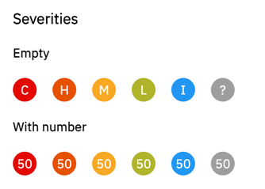
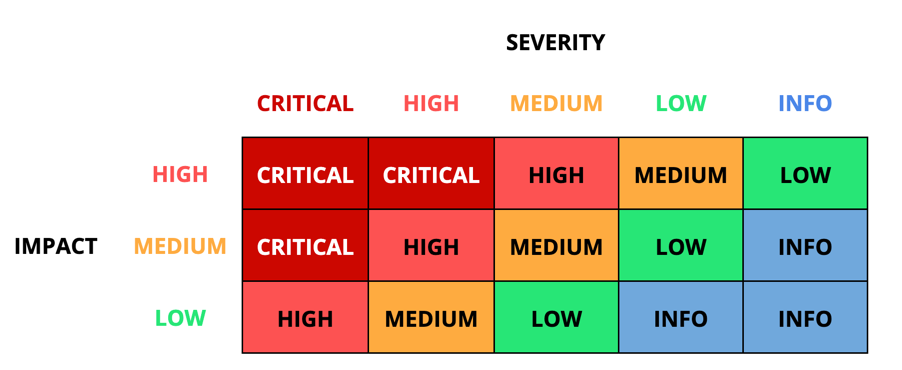

# Risk Score

## Definition

The Risk Score is an indicator that is used to calculate the priority to assign to observations.
We compute this score as an indicative measure of the risk given the conditions in which the observation was created.

The Risk Score ranges from INFO to CRITICAL.

## Severity

### CVSS v3.x

CVSS v3.x defines a qualitative measure of severity of a vulnerability.
[As they define in their own documentation](https://nvd.nist.gov/vuln-metrics/cvss), **CVSS is not a measure of risk**.

CVSS v3.x defines the severity scoring as follows:

| Severity | Score Range |
|----------|:-----------:|
| NONE     |     0.0     |
| LOW      |  0.1 - 3.9  |
| MEDIUM   |  4.0 - 6.9  |
| HIGH     |  7.0 - 8.9  |
| CRITICAL | 9.0 - 10.0  |

### Modron

In Modron, the Severity matches the CVSS v3.x severity levels - with the exception of the "NONE" severity that
is called "INFO". Rules can define the severity of the observations they create:
```go
ob := &pb.Observation{
    Name:          "BUCKET_IS_PUBLIC",
    ExpectedValue: "private",
    ObservedValue: "public",
    Remediation: &pb.Remediation{
        Description: "Bucket foo is publicly accessible",
        Recommendation: "Unless strictly needed, restrict the IAM policy of the bucket",
    },
    Severity: pb.Severity_SEVERITY_MEDIUM, // <-- We define the severity here
}
```

| Severity |
|----------|
| INFO     |
| LOW      |
| MEDIUM   |
| HIGH     |
| CRITICAL |

#### UI representation

In the UI we represents the severities (together with the risk score and the impact) using the following icons:

<p align="center">

</p>

The screenshot includes a "?" severity - this is a very special case that is used when the severity is not known and 
indicates a bug in the code if it is displayed in the UI.


#### Re-using the CVSS v3.x score

When available, we use the CVSS v3.x score to map it to the Modron severity (external sources) - internally in Modron we
use the scale directly (e.g: a rule defines its observations to be LOW severity)

## Impact

Since the CVSS score (and the Modron Severity) do not measure risk, we use "facts" to calculate the _Impact_ of
an observation. The impact, when combined with the severity, is used to determine the Risk Score of an observation.

### Definition

An _Impact_ can only assume three values: LOW, MEDIUM or HIGH.

To define the impact, we collect context about the environment in which the observation was generated that we call "facts".
We always take the highest impact defined by the list of facts to determine the final impact.

### Facts

An example of a fact is "workload is from the production environment". This is a fact that can make a misconfiguration more impactful.
By leveraging these informations we can increase or decrease the risk score.

#### Real-world example

| Kind        | Example                                                      | Decision       |
|-------------|--------------------------------------------------------------|----------------|
| Observation | A misconfigured SQL database is accessible from the internet | Severity: HIGH |
| Fact        | The database contains sensitive information                  | Impact: HIGH   |
| Fact        | The database is not used                                     | Impact: LOW    |
| Fact        | The database is not used in production                       | Impact: LOW    |

The rule "SQL database is accessible from the internet" defines the severity of the observations as HIGH.
One of the facts sets the impact to be HIGH, while the other two facts set the impact to be LOW: we always take
the worst case scenario when defining the impact, so the final impact is HIGH.

We now have the Severity (HIGH) and the Impact (HIGH). We can now calculate the Risk Score.

## Risk Score

The Risk Score calculation is straight-forward:

- If the impact is **MEDIUM**, the risk score is equal to the severity,
- If the impact is **HIGH**, the risk score is one category higher than the severity (e.g: **MEDIUM** -> **HIGH**)
- If the impact is **LOW**, the risk score is one category lower than the severity (e.g: **MEDIUM** -> **LOW**)

We can therefore define a "Risk Score matrix" as follows:

<p align="center">

</p>

### Examples

- A HIGH severity observation with a HIGH impact will have a CRITICAL risk score
- A HIGH severity observation with a MEDIUM impact will have a HIGH risk score
- A HIGH severity observation with a LOW impact will have a MEDIUM risk score
- An INFO severity observation with a LOW impact will have an INFO risk score (can't get lower than INFO)
