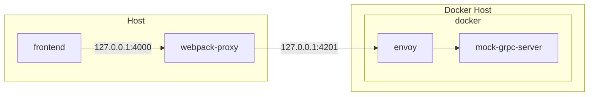

# Modron UI
User interface for the Modron service.

## Dependencies
- Docker
- Node.js LTS
- Angular CLI

## How to run

```bash
npm run dev  # Run UI with mock gRPC server and envoy proxy
```

Then navigate to `localhost:4200`.


## Developing on MacOS with [Lima](https://github.com/lima-vm/lima)

### Frontend with `mock-grcp-server`

When you're developing against the `mock-grpc-server` (`npm run dev`), this will be the setup:



### Frontend with Modron as a backend

1. Start the backend (either with `docker-compose.yml` or via `go run ./src`) and make sure it's listening on `:4201`
1. In this directory (`src/ui`), run `npm run dev:client`
